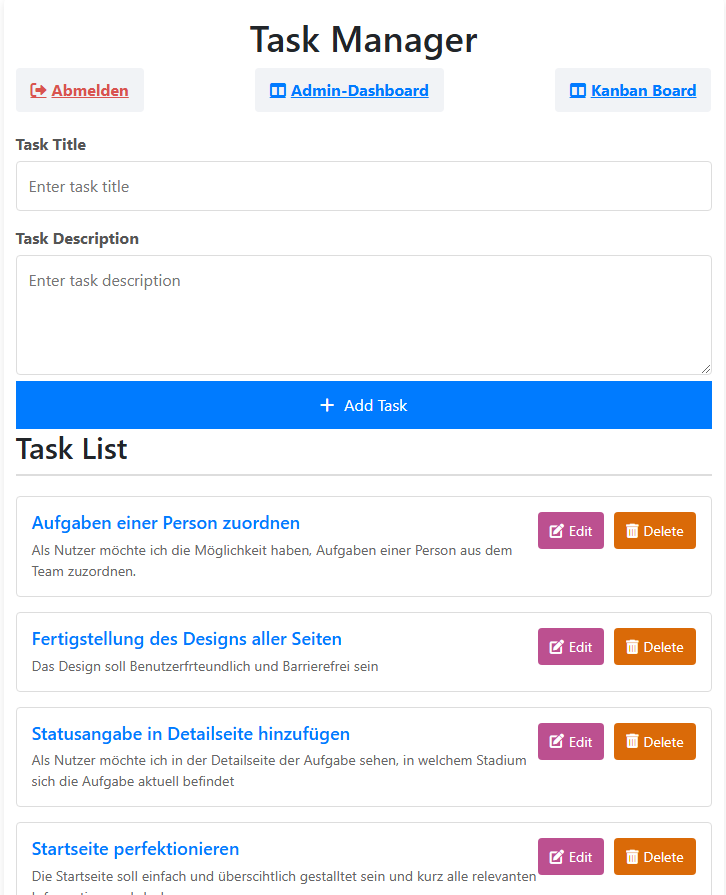

{: .no_toc }
# Reference documentation

{: .text-delta }

Table of contents

+ ToC
{: toc }

## Modul: Authentifizierung

**Route:** /login

**Methoden:** POST, GET

**Zweck:**
Diese Funktion ermöglicht es registrierten Benutzern, sich mit ihrer E-Mail und ihrem Passwort im System anzumelden. Falls die Anmeldedaten korrekt sind, wird eine Sitzung gestartet und die Benutzerrolle zurückgegeben. Falls die Anmeldedaten falsch sind, wird eine entsprechende Fehlermeldung ausgegeben.

**Beispielausgabe:**
Nach erfolgreicher Anmeldung wird der Benutzer auf das Kanban-Board weitergeleitet:

Falls das Passwort oder die E-Mail falsch ist:

"❌ Falsches Passwort für: user@test.de."

## Modul: Registrierung

**Route:** /registrierung

**Methoden:** POST, GET

**Zweck:**
Neue Benutzer können sich über diese Route registrieren, indem sie eine E-Mail-Adresse und ein Passwort eingeben. Das Passwort wird vor der Speicherung gehasht. Falls die E-Mail bereits existiert, wird eine Fehlermeldung ausgegeben.

**Beispielausgabe:**
Nach erfolgreicher Registrierung wird der Benutzer zum Log-In weitergeleitet, um sich dort das erste mal anzumelden. 

Falls die E-Mail nicht Konform eingegeben wurde, das Passwort vergessen oder die Nutzungsbedingungen nicht akzeptiert worden sind erscheint eine Fehlermeldung wie diese:

## Modul: Task Manager

**Route:** /task_manager/

**Methoden:** GET

**Zweck:**
Diese Route gibt eine Liste aller vorhandenen Aufgaben zurück. Aufgaben enthalten eine ID, einen Titel, eine Beschreibung, einen Status und den Ersteller der Aufgabe.

**Beispielausgabe:**

# add_task()

**Route:** /task_manager/add_task

**Methoden:** POST

**Zweck:**
Diese Funktion ermöglicht es Benutzern, neue Aufgaben zu erstellen. Dabei werden der Titel und die Beschreibung angegeben. Die Task wird zudem auch automatisch dem Status: "Im Backlog" zugewiesen.

**Beispielausgabe:**

# delete_task(task_id)

**Route:** /task_manager/delete_task/<int:task_id>

**Methoden:** POST

**Zweck:**
Löscht eine Aufgabe anhand ihrer ID. Falls die Aufgabe nicht existiert, wird eine Fehlermeldung zurückgegeben.

**Beispielausgabe:**

## Modul: Kanban-Board#

# kanban_board_view()

**Route:** /kanban_board/

**Methoden:** GET

**Zweck:**
Diese Route zeigt das Kanban-Board mit allen aktuellen Aufgaben, gruppiert nach Status (To Do, In Progress, Done).

**Beispielausgabe:**

# update_status()

**Route:** /kanban_board/update_status

**Methoden:** POST

**Zweck:**
Ändert den Status einer Aufgabe. Der Benutzer kann eine Aufgabe z. B. von 'To Do' auf 'In Progress' verschieben.

**Beispielausgabe:**

## Modul: Benutzerverwaltung

# admin_dashboard()

**Route:** /admin_dashboard

**Methoden:** GET

**Zweck:**
Diese Route zeigt das Admin-Dashboard, in dem Administratoren Benutzer verwalten können. Administratoren können Rollen ändern und Benutzerkonten löschen, sowie nach bestimmten Konten Suchen.

**Beispielausgabe:**

![Admin-Suche]../(images/Admin-Suche.png)

# change_role()

**Route:** /change_role

**Methoden:** POST

**Zweck:**
Ermöglicht es Administratoren, die Rolle eines Benutzers zu ändern. Beispielsweise kann ein Benutzer von 'Benutzer' auf 'Manager' hochgestuft werden.

**Beispielausgabe:**

# delete_user(user_id)

**Route:** /delete_user/<int:user_id>

**Methoden:** GET

**Zweck:**
Löscht einen Benutzer aus dem System. Nur Administratoren haben im Admin-Dashboard Zugriff auf diese Funktion.

**Beispielausgabe:**

